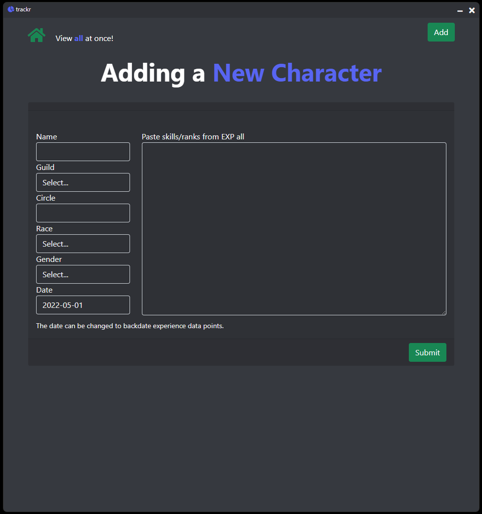

# trackr

## If you like data and want to easily track your experience progression through the Dragon's Realms, you've come to the right place.  
  
When you begin to track a character you'll need to add a little about them; like name, guild, race, gender, etc., but these can all be edited later.  When updating a character, all you have to do is copy and paste your `EXP all` from DragonRealms (just what's between `SKILL:...Fraction` and your `TDPs`)!  Like so:
  
```
    Shield Usage:    635 26% deliberative  (11/34)     Light Armor:    627 13% clear          (0/34)
     Chain Armor:    640 44% clear          (0/34)      Brigandine:    633 35% thoughtful     (4/34)
     Plate Armor:    612 47% clear          (0/34)       Defending:    638 61% considering    (6/34)
   Parry Ability:    626 73% clear          (0/34)     Small Edged:    591 25% clear          (0/34)
     Large Edged:    591 37% clear          (0/34) Twohanded Edged:    591 63% clear          (0/34)
     Small Blunt:    591 49% clear          (0/34)     Large Blunt:    591 75% clear          (0/34)
 Twohanded Blunt:    591 37% clear          (0/34)          Slings:    592 27% clear          (0/34)
             Bow:    591 77% clear          (0/34)        Crossbow:    592 24% clear          (0/34)
          Staves:    591 52% clear          (0/34)        Polearms:    591 36% clear          (0/34)
    Light Thrown:    632 78% perusing       (2/34)    Heavy Thrown:    632 78% clear          (0/34)
        Brawling:    630 66% clear          (0/34)  Offhand Weapon:    646 83% deliberative  (11/34)
   Melee Mastery:    667 62% clear          (0/34) Missile Mastery:    656 19% deliberative  (11/34)
     Lunar Magic:   1017 86% thinking       (5/34)      Attunement:   1060 02% thoughtful     (4/34)
          Arcana:    920 69% thinking       (5/34)  Targeted Magic:    718 65% clear          (0/34)
    Augmentation:    901 20% learning       (3/34)    Debilitation:    691 73% clear          (0/34)
         Utility:    856 87% perusing       (2/34)         Warding:    815 05% perusing       (2/34)
         Sorcery:    722 13% perusing       (2/34)       Astrology:    981 86% dabbling       (1/34)
         Evasion:    697 78% clear          (0/34)       Athletics:    696 32% clear          (0/34)
      Perception:    887 41% thoughtful     (4/34)         Stealth:    670 44% intrigued     (16/34)
    Locksmithing:    637 19% intrigued     (16/34)        Thievery:    691 56% cogitating    (24/34)
       First Aid:    649 68% perusing       (2/34) Outdoorsmanship:    588 05% clear          (0/34)
        Skinning:    674 10% clear          (0/34)         Forging:    173 90% clear          (0/34)
     Engineering:    190 33% clear          (0/34)      Outfitting:    180 21% clear          (0/34)
         Alchemy:    168 12% clear          (0/34)      Enchanting:    178 47% clear          (0/34)
     Scholarship:    785 49% clear          (0/34)       Appraisal:    635 30% clear          (0/34)
     Performance:    685 12% clear          (0/34)         Tactics:    693 98% considering    (6/34)
```
  
Also, trackr uses default images based on guild and gender to add a little color to the application.  
Check out the screenshots below!



